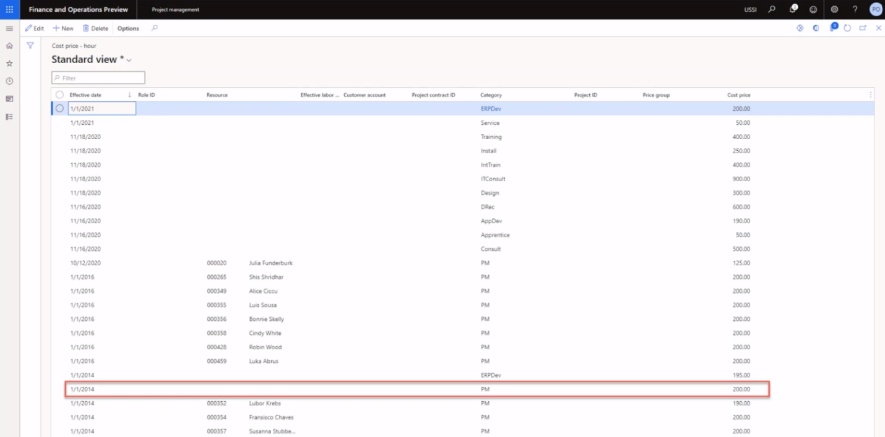

---
demo:
  title: 示範 1：Project Operations 定價
  module: 'Module 5: Learn the Fundamentals of Microsoft Dynamics 365 Project Operations'
---

## 示範 1 - Project Operations 定價

1. 瀏覽至 [專案管理]**** 工作區。  
    在此示範中，我們將設定 Project Operations 內的銷售和成本價格。 我們將瞭解成本和價格如何衍生自先前過帳的發票。

1. 請在右上方的公司選擇器中，確認您所連線的法律實體為 [USSI]****。  
    若不是，請將組織變更為 [USSI]****。

1. 在 [使用中專案]**** 表中，請選取專案 **00000093 Contoso Consulting**。 這會開啟專案詳細資料檢視。

    ![[作用中專案] 資料表中醒目提示 Contoso Consulting 的專案管理工作區螢幕擷取畫面。](./media/projops_prices_1_selecting_contoso_consulting.png)

1. 在 **Contoso Consulting** 頁面的瀏覽列中，請選取 [管理]**** 索引標籤。

1. 在 [管理]**** 功能表中，選取 [發票日誌]****。  
    在這裡，我們找到了套用時數的發票。

1. 在 [發票交易]**** 底下的 [銷售價格]**** 資料行中，指向 **350.00**。  
    在此檢視中，我們可以看到 USSI 專案經理 Aaron Con 的資源銷售價格為 350 美元。 我們來檢閱設定的定價，以瞭解該定價的判斷方式。

      

    雖然我們可以查看個別專案的價格，但我們會從 [專案管理]**** 工作區開始，以便查看所有已設定的價格。

1. 瀏覽至 [專案管理]**** 工作區。

1. 在畫面右側的 [連結]**** 區段中，於 [設定]**** 子功能表中，選取 [銷售價格 (小時)]****。

1. 在 [銷售價格 – 小時]**** 頁面上，於 資料表的 [定價]**** 資料行中，指向 **350.00**。  
從此檢視來看，我們可以看到設定 Aaron Con 的售價為 350 美元的位置。

1. 指向整個第一個資料列。  
    如果我們檢視整個資料列，我們可以看到 Aaron 已設定為專案經理，更具體來說，費率會與 Contoso Consulting 的特定專案識別碼相關聯。

1. 在 [資源] **** 資料行中，指向已指派資源的其他所有資料列。  
    在此資料表中，我們可以看到還有設定了其他專案經理，但沒有特別配置專案識別碼，因此其費率只會針對指派的類別和資源。

    ![[銷售價格 - 小時] 頁面的螢幕擷取畫面，其中醒目提示資料表中已指派資源的所有資料列。](./media/projops_prices_3_resources_table.png)  

    此矩陣具有足夠的彈性支援 Contoso Consulting 和 Aaron Con 的詳細資料層級，以及支援更通用的定價模式，例如此處顯示的 $300 價格。

1. 針對 Contoso 專案，瀏覽至 [發票日誌]** **頁面。  
    回到過帳的發票，我們將查看相同的過帳時數交易，並檢閱與 Aaron Con 相關聯的成本，方法是選取發票交易行上的交易識別碼。

1. 在 [發票交易]**** 區段中，選取 [小時]**** 索引標籤。在出現的資料表中，於 [交易識別碼]**** 資料行選取交易識別碼。

    ![[發票日誌] 頁面的螢幕擷取畫面，其中已醒目提示交易識別碼資料行。](./media/projops_prices_4_select_a_transaction_id.png)

1. 在 [小時交易]**** 區段中，選取 [概觀]**** 索引標籤。在出現的資料表中，於 [交成本價格]**** 資料行指向 **200.00**。  
    從小時交易的檢視中，我們可以看到 Aaron Con 的項目，且相關聯的成本價格為 $200 美元。 我們來回頭看看成本價格設定，以瞭解該成本率的衍生方式。

1. 瀏覽至 [專案管理]**** 工作區。

1. 在畫面右側的 [連結]**** 區段中，於 [設定]**** 子功能表中，選取 [成本價格 (小時)]****。

1. 在 [成本價格 – 小時標準]**** 檢視頁面上，在資料表中，指向 [有效日期]**** 資料行中具有 **2014/1/1** 的資料列、[類別]**** 資料行中的 **PM**、[成本價格]**** 資料行中的 **200.00**，而其他資料行中沒有值。  
    在這個檢視我可以看到已特別針對 PM 類別設定的 200 美元成本價格，但沒有 Aaron 或 Contoso Consulting 專案專屬的其他行。 這也是常見的做法，因為許多服務組織會跨類別套用標準成本率，在此案例中會識別為專案角色。 此成本通常是混合費率，其中個別資源工資率只會儲存在薪資或 HR 系統中。 然後，標準成本率會定期調整，因為會分析工資成本，以確保其準確無誤，並符合獲利率。

    

1. 瀏覽至 [專案管理]**** 工作區。

1. 在畫面右側的 [連結]**** 區段中，於 [設定]**** 子功能表中，指向 [成本價格 (小時)]**** 和 [銷售價格 (小時)]****。  

在此示範中，我們已探索如何在 Project Operations 中設定標準銷售和成本價格。 我們已檢閱他們對已過帳發票的影響，以瞭解這些價格的設定如何影響呈現的時間和材料發票。
