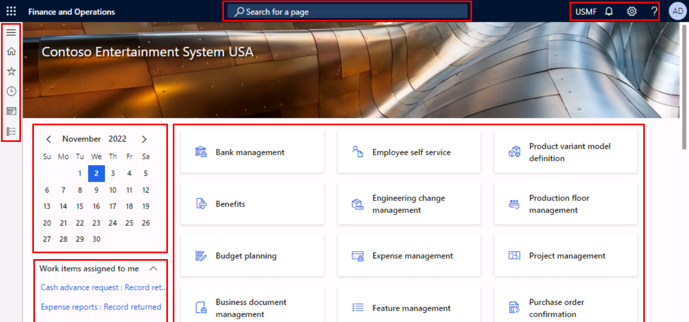

---
lab:
  title: '實驗室 1:瀏覽財務與營運應用程式'
  module: 'Module 1: Explore the core capabilities of Dynamics 365 finance and operations apps'
---

# 單元 1：探索 Dynamics 365 財務和營運應用程式的核心功能

## 實驗室 1:瀏覽財務與營運應用程式

## 目標

現在您已經熟悉了財務與營運應用程式，請花一些時間來探索其介面。

## 實驗設定

- **預估時間**：10 分鐘

## 指示

### 請登入實驗室電腦

1.  使用下列認證登入實驗室電腦：

    - 使用者名稱： `Administrator`

    - 密碼：`pass@word1`

1.  繼續前，請等候 AdminUserProvisioning 指令碼完成。 這可能需要 2-3 分鐘。 指令碼完成之後，將會短暫顯示一個快顯方塊，以確認管理員使用者已成功更新。 

1.  **Microsoft Edge** 將會開啟 Finance & Operations URL：<https://usnconeboxax1aos.cloud.onebox.dynamics.com>

1.  使用 [資源] 功能表中提供的 [使用者名稱] 與 [密碼] 登入。 

### 瀏覽財務與營運應用程式

1.  在 [ **財務與作業首頁** ] 頁面上，您會看到： 

    - 預設情況下左側的瀏覽功能表已摺疊。 

    - 公司的預設橫幅影像。 

    - 根據您在組織中的角色，您可以使用工作區磚。 

    - 指派給您的一個行事曆和工作項目。 

    - **搜尋頁面**列，對於快速尋找您需要的內容非常有用。 

    - 在右上方，您可以看到目前合作的公司、通知、設定和幫助連結。 

    

1.  驗證已列出的公司是 **USMF**。 

1.  在左上方，請選取[**展開瀏覽窗格**] 漢堡功能表。 

1.  可以在瀏覽窗格中找到 [**我的最愛**]、[**最近項目**]、[**工作區**] 和 [**模組**] 的集合。 

1.  在瀏覽窗格中，請選取 [**模組**] > [**系統管理**]。 

1.  **檢閱****系統管理**模組中可用的不同區域。 

1.  在 [**設定**] 下，請選取 [**用戶端效能選項**]。 

1.  在用戶端效能選項窗格的 [已啟用圖說文字功能] 下，選取切換參數，並將其設定為 [是]。 

1.  檢閱其他可用的選項，捲動至窗格底部，然後選取 [ **確定**]。 

1.  在首頁的右上方，選取 [ **設定** ] 圖示，然後選取 [ **使用者選項**]。 

    

1.  在 [ **使用者選項** ] 頁面上，使用索引標籤來設定將套用至您的帳戶的不同設定。 

1.  請選取 [**喜好設定**] 索引標籤。 

1.  檢閱可用的喜好設定。 請注意，您可以變更登入時會看到的預設 **[公司** ] 和 [ **初始] 頁面** 。 

1.  請選取並檢閱 [**帳戶**] 和 [**工作流程**] 索引標籤。 

1.  請在左側瀏覽功能表中，選取 [**首頁**] 圖示。 

1.  請在首頁的上方置中選擇 [**搜尋一個頁面**] 方塊。 

1.  在搜尋方塊中，搜尋 `All vendors` 

1.  第一次搜尋頁面時，可能需要等待一段時間。 搜尋正在處理中，您會在搜尋方塊的右側看到一個小的旋轉圓圈。 

1.  選取第一個結果 **[所有廠商**]，這與流覽至 [**模組**  >  **帳戶應付**  >  **廠商**  >  **所有廠商]** 相同。 

1.  **[所有廠商**] 頁面是清單頁面的範例。 清單頁面一般包含可以讀取、建立、刪除和更新的主要資料。 您將會看到使用清單上方動作窗格提供的其他函式。 

    

1.  從清單中反白顯示其中一個廠商，並在右側選取 [ **相關資訊** FactBox] 窗格，然後檢閱提供的其他資訊。 

1.  在廠商清單中，開啟 **Acme Office 供應專案** 記錄。 

1.  選取動作窗格中的 **[編輯** ]，然後在 [ **群組** ] 欄位中，選取下拉式功能表，然後選取 [ **廠商群組** ] 資料行標題。 

    

1.  許多功能表都有可用的 **排序** 和 **篩選** 。 使用篩選來快速定位您要查找的欄位內容。 如果您已經知道此值，您可以直接將它輸入欄位中，而不是使用下拉式功能表。 

1.  在動作窗格右側，請注意其他功能。 將滑鼠停留在每個專案上，然後檢閱功能圖說文字。 

1.  選取 [ **關閉** ] 圖示以關閉此記錄，並返回 [ **所有廠商** ] 清單頁面。 

    ![清單頁面右上方功能表會顯示用於連接至 [Power Apps]、[Office 應用程式]、[附件]、[重新整理]、[在新視窗中開啟] 與 [關閉] 按鈕的其他功能](./media/m1-common-list-page-additional-features-menu.png)

1.  在右上方，選取 **？** 問號圖示，然後選取 [ **說明**]。 

1.  請注意，說明資訊窗格會顯示目前頁面的內容。 **關閉** [說明] 窗格。 

1.  使用左上方的 [**財務和作業**] 按鈕，或左側導覽功能表中的 [**首頁**] 圖示，返回 **[預設] 儀表板**。 

    > **注意：** 鍵盤快速鍵：Alt+Shift+Home。 Dynamics 365 Finance 和 Operations 支援許多鍵盤快速鍵，以加速存取系統：https://learn.microsoft.com/en-us/dynamics365/fin-ops-core/fin-ops/get-started/shortcut-keys

1.  請嘗試選取 **[工作區] 圖格**，然後檢閱該工作區的說明資訊。 完成時，返回 [預設儀表板]。 

