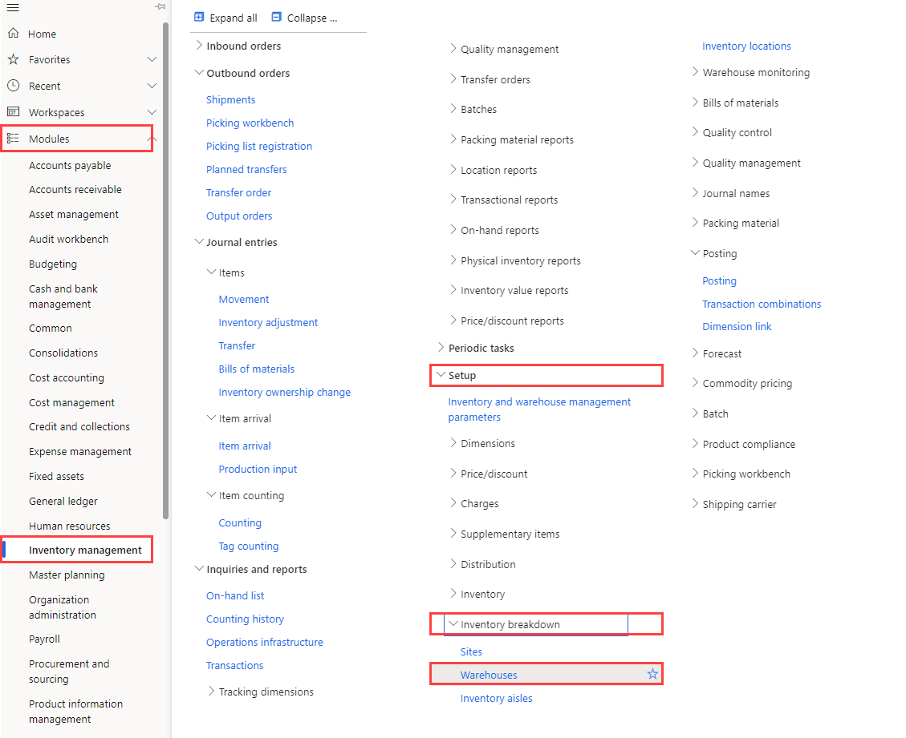

---
lab:
  title: 實驗室 5：建立倉庫
  module: 'Module 1: Learn the Fundamentals of Microsoft Dynamics 365 Supply Chain Management'
ms.openlocfilehash: 919ea602b0768683acd845dd184b3bf5a0364fd0
ms.sourcegitcommit: 252458fca8e71b6e5e8b99ae4c2b47cd85461a30
ms.translationtype: HT
ms.contentlocale: zh-TW
ms.lasthandoff: 01/27/2022
ms.locfileid: "137909466"
---
# 單元 1：學習 Microsoft Dynamics 365 Supply Chain Management 的基礎知識

## 實驗室 5 – 建立倉庫

## 目標
Supply Chain Management 中的倉庫管理系統為您提供彈性的方式來定義您的倉庫配置以滿足不斷變化的需求，從而達成倉庫效率最佳化。

- 您可以建立高優先順序和低優先順序儲存區域，以實現貨物的最佳放置。
- 您可以將倉庫劃分為多個區域，以適應各種儲存需求，例如溫度要求或項目的各種周轉率。
- 您可以在任何層級指定倉庫位置 (例如，站台、倉庫、通道、機架、貨架和倉位位置)。
- 您可以使用實體容量限制設定來對位置進行分組。
- 您可以根據查詢定義的規則來控制物品的儲存和挑選方式。

要在 Supply Chain Management 中使用倉庫管理，您必須建立一個倉庫並啟用它，以進行更進階或專業的倉庫管理活動。

## 實驗設定

   - **預估時間**：10 分鐘

## 指示

1. 在 Finance and Operations 首頁的右上方，請確認您正在與 USMF 公司合作。

1. 如有必要，請選擇公司，然後從功能表中選取 **USMF**。

1. 在左側瀏覽窗格中，選取 [模組] > [庫存管理] > [設定] > [庫存明細] > [倉庫]。

    

1. 在倉庫頁面的上層功能表上，選取 [新增]。

1. 在 [倉庫] 欄位中，請輸入 **101**。

1. 在 [名稱] 欄位中，請輸入 **溢位倉庫**。

1. 請選取 [站台] 功能表，然後選取 [3 Home 泡沫生產]。

1. 請展開 [位置名稱]。  
    這個區段中的選項定義了位置名稱的預設格式。

1. 請將 [包括通道]和 [包括機架] 選項設定為 [是]。

1. 請在 [格式] 方塊中為機架輸入一個值。  
    例如，如果機架位置名稱的格式必須包含 OVFL，您將在格式方塊中輸入該值。

1. 在 [層級]下將 [包括貨架] 選項設定為 [是]。

1. 在 [格式] 欄位中，請針對貨架輸入 **-##** 。

1. 請在上層功能表選擇 [倉庫]。

    

1. 在 [維護] 下，請選擇 [位置精靈]。

1. 請在歡迎頁面上檢閱該資訊，然後在右下角選取 [下一步]。

1. 清除 [輸出碼頭] 和[大量位置] 核取方塊。

1. 請選取 [下一步] 並檢閱該資訊。

1. 請繼續閱讀每一頁，然後在完成後選取 [完成]。

1. 請關閉頁面並返回首頁。
