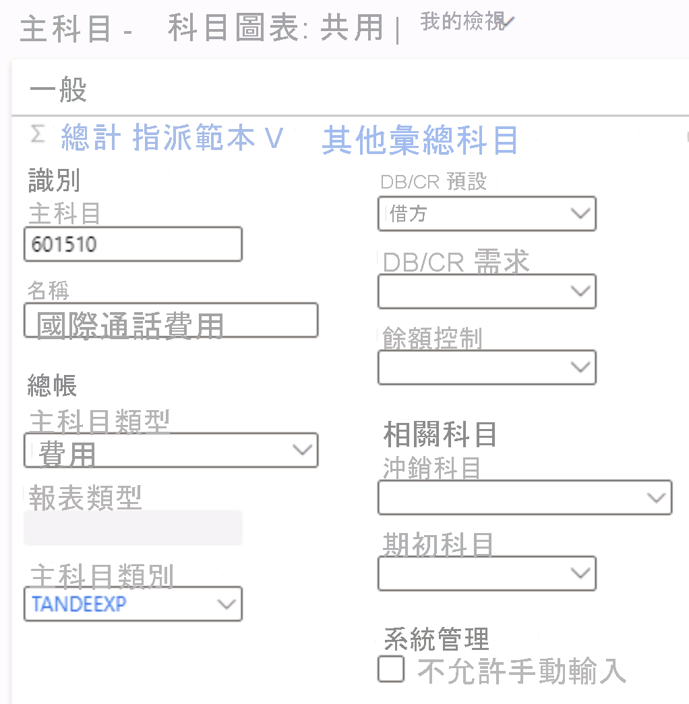

---
lab:
  title: 實驗室 1:建立主要帳戶
  module: 'Module 2: Learn the Fundamentals of Microsoft Dynamics 365 Finance'
ms.openlocfilehash: 6568afcb26212ab952a48dfaf7bb4f377e4ffd36
ms.sourcegitcommit: aa74c0578c7018838f0c935f5901e9c667ef0801
ms.translationtype: HT
ms.contentlocale: zh-TW
ms.lasthandoff: 07/14/2022
ms.locfileid: "147116649"
---
# 課程模組 2：學習 Microsoft Dynamics 365 Finance 的基礎知識
    
## 實驗室 1 – 建立主要帳戶

## Instructions

1. 在 **Finance and Operations 首頁** 的右上方，請確認您正在與 USMF 公司合作。

2. 如有必要，請選擇公司，然後從功能表中選取 **USMF**。

3. 在左側瀏覽窗格中，選取 [模組] > [一般底帳] > [會計圖表] > [帳戶] > [主要帳戶]。

4. 在上層功能表，請選取 **+新增**。

5. 在 [主要帳戶] 頁面上，輸入以下值：

    - 主要帳戶：**601510**

    - 名稱：**國際通話費用**

    - 主要費用類型：**費用**

    - 主要帳戶類別：**TANDEEXP**

    - DB/CR 預設：**Debit**

 
