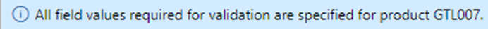

---
lab:
  title: 實驗室 1：建立新產品
  module: 'Module 3: Learn the Fundamentals of Microsoft Dynamics 365 Supply Chain Management'
---

# 課程模組 3：學習 Microsoft Dynamics 365 Supply Chain Management 的基本概念

## 實驗室 1：建立新產品

## 目標

在 Contoso Entertainment System USA (USMF) 中，您計劃從某家廠商購買新的封包設定。 您需要建立一個項目來代表新的設定。 在本實驗室中，您會瞭解如何建立新項目和項目設定。

## 實驗設定

   - **預估時間**：10 分鐘

## 指示

在 Contoso Entertainment System USA (USMF) 中，您計劃從某家廠商購買新的封包設定。 您需要建立一個項目來代表新的設定。

1.  在 [財務和營運] 首頁的右上方，確認您使用的是 [USMF]**** 公司。 如有必要，可選取公司下拉式功能表的 [USMF]****。

2.  在左上方，請選取[展開瀏覽窗格]**** 漢堡功能表。

3.  在瀏覽窗格中，選取 [模組]****，然後選取 [產品資訊管理]****。 接著，在 [產品]**** 功能表上，選取 [產品]****。

4.  在 [產品]**** 頁面的頂端功能表，選取 [+新增]****。

5.  在 [新產品]**** 窗格中，確認已選取 [產品類型]**** 欄位的 [項目]****。

6.  在 [產品子類型]**** 欄位中，確認已選取 [產品]****。

7.  在 [識別]**** 下的 [產品號碼]**** 方塊中，輸入 **GTL007**。

8.  在 [產品名稱]**** 方塊中，輸入 **Cabinet 2**。

    

9.  選取 [確定] **** 按鈕。

10. 在 [動作窗格] 的 [產品]**** 功能表下，選取 [設定]**** 群組底下的 [維度]**** 群組。

    ![螢幕擷取畫面描述產品功能表下的 [設定] 選項，其中可以新增不同的維度群組詳細資料。](./media/03-learn-the-fundamentals-of-dynamics-365-supply-chain-management-08.png)

11. 選取 [儲存體維度群組]**** 下拉式功能表，選取 [SiteWH]****。

12. 選取 [追蹤維度群組]**** 下拉式功能表，選取 [無]****。

13. 選取 [確定] **** 按鈕。

14. 選取 [動作窗格] 中的 [發行產品]**** 按鈕，以釋放法律實體中的產品。

15. 隨即開啟頁面，其中顯示第一個步驟為 [選取要發行的產品]****。

    

16. 選取頁面底部的 [下一步] **** 按鈕

17. 在 [選取要發行的公司]**** 頁面中，選取 應發行產品的[USMF]**** 法律實體。

18. 選取頁面底部的 [下一步] **** 按鈕。

19. 在 [確認選取範圍]**** 頁面中，將 [失敗時顯示 Infolog 的值] **** 設定為 [是]****，並將 [以批次執行]**** 設定為 [否]****。

20. 選取頁面底部的 [完成] **** 按鈕。

21. 在瀏覽窗格中，選取 [模組]，然後選取 [產品資訊管理]。 接著，在 [產品] 功能表上，選取 [發行產品]****。

22. 在 [已發行]**** 的 [產品] **** 頁面中，找出方格中的新項目 **GTL007**。 

23. 選取產品連結並瀏覽至 [產品詳細資料]**** 頁面。

24. 在 [一般]**** FastTab 中，輸入下內容：

    - **項目模型群組 **：FIFO

25. 在 [購買]**** FastTab 中，輸入下內容：

    - **單位**：ea

    - **項目銷售稅群組**：ALL

    - **價格**：30

26. 在 [銷售]**** FastTab 中，輸入下內容：

    - **單位**：ea

    - **項目銷售稅群組**：ALL

    - **價格**：35

27. 在 [管理庫存]**** FastTab 中，輸入下內容：

    - **單位**：ea

28. 在 [工程師]**** FastTab 中，輸入下內容：

    - **BOM 單位**：ea

29. 在 [管理成本]**** FastTab 中，輸入下內容：

    - **項目群組**：音訊

30. 若要完成設定，請選取 [動作窗格中的產品]。 選取 [維護] 群組底下的 [驗證] 按鈕

    ![螢幕擷取畫面顯示動作窗格中 [產品] 按鈕底下的 [維護] 群組。 已選取 [維護] 群組底下的 [驗證] 按鈕。](./media/03-learn-the-fundamentals-of-dynamics-365-supply-chain-management-10.png)

31. 驗證是否顯示資訊橫幅，確認所有必要的欄位值都已驗證。

    

32. 關閉所有頁面並返回首頁。
