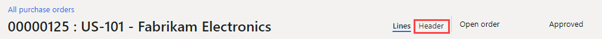
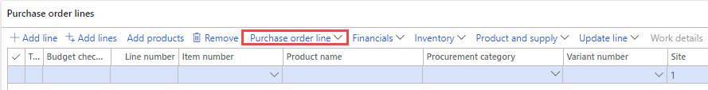

---
lab:
  title: 實驗室 2：建立採購單
  module: 'Module 3: Learn the Fundamentals of Microsoft Dynamics 365 Supply Chain Management'
---

# 模組 3：學習 Microsoft Dynamics 365 Supply Chain Management 的基礎知識

## 實驗室 2：建立採購單

## 實驗設定

   - **預估時間**：15 分鐘

## 目標

作為主要計畫、直接交付和其他流程的結果，自動建立採購單更為常見。 手動建立採購單時通常都會由採購專員來建立。 使用 USMF 公司建立採購單。 

## 實驗設定

   - **預估時間**：10 分鐘

## 指示

1.  在 **[財務與營運] 首頁** 的右上方，確認您是使用 **USMF** 公司。 

1.  如有必要，請選擇公司，然後從功能表中選取 **USMF**。 

1.  在左上方，請選取[**展開瀏覽窗格**] 漢堡功能表。 

1.  在 [**採購和來源]** 模組中，選取 [**採購單**  >  **] [所有採購單**]。 

1.  在 [ **所有採購單]** 頁面上的 [動作] 窗格中，選取 **[+ 新增**]。 

1.  在 [ **建立採購單]** 窗格中，選取 [ **廠商帳戶** ] 欄位，然後輸入或選取 `US-101`

1.  當您選取廠商時，廠商記錄的詳細資料，例如位址、發票帳戶、傳遞條款及傳遞模式，都會複製到採購單標頭中。 如有需要，您可以變更這些值。 

1.  請展開**一般**區段。 

1.  在**儲存維度**下，請選取**站台**功能表，然後檢閱站台清單。 

    > **注意：** [ **網站** ] 欄位與 **[倉儲]** 欄位一起指定必須交付採購商品或服務的位置。 預設傳遞位址取自 **網站**。 可以使用為所選供應商設定的值填入這兩個欄位，也可以手動指定它們。 

1.  針對 **[倉儲**]，輸入或選取 `13`

1.  在 [日期]**** 下，[交貨日期]**Delivery date** 欄位用於指定何時需要交付已採購的貨物和服務。

    > **注意：** 您可以指定訂單的單一傳遞日期，也可以指定個別訂單行的唯一傳遞日期。 如果特定產品或服務由於前置時間較長而無法滿足此處指定的交付日期，這些交付日期較晚的明細則將被建立以適應這種情況。

1.  請展開**管理**區段。 **Orderer**欄位可用來指定誰正在下訂單。 

    > **注意：** 如果廠商需要連絡該人員，這可能很方便。 如果目前的使用者帳戶與 [**使用者**] 頁面上的 **[人員**] 記錄相關聯，可能會自動指派此值。 

1.  選取 [確定]。 

1.  現在已建立訂單標題。 使用採購單明細時，只顯示標題資訊的摘要。 如果您需要檢視其餘的資訊，請選取 **[標頭] 索引** 標籤。 

    

1.  在 **[採購單行**] 下方的工具列中，選取 **[採購單行]** 功能表。 

    

1.  在**顯示**下，請選取**維度**。 

    > **注意：** 產品可以是依維度區分的變體，例如色彩、大小或樣式。 還可以將產品設定為使用儲存維度，例如站台和倉庫。 還有選用的追蹤維度，例如批次和序號。 為提高訂單項目的效率，您可以將常用的維度欄位直接新增至訂單網格中。 

1.  在 [ **維度顯示]** 窗格的 **[產品維度]** 底下，選取 [ **色彩**]。 

1.  *選：* 如果您選取 [ **儲存設定** ] 切換開關，當您下次開啟採購單頁面時，您所選擇的維度也會顯示在訂單行方格上。 

1.  選取 [確定]。 

1.  在 **[採購單明細**] 下，選取 [ **專案號碼** ] 欄位，然後選取 **[T0004**]。 

    > **注意：** 請記住，您也可以在 **[篩選**] 中輸入 `T0004` ，而不是捲動清單。 

    > **注意：** 訂單明細是藉由指定 **專案編號** 或指定 **採購類別**來作為費用來建立產品和服務。
    > 
    > **採購類別** 用於新增直接支付採購專案的明細，而不是進入庫存。 這表示如果您需要支付購買費用，您可以建立指定 **採購類別**的採購單行，而不是建立具有 **專案編號**的明細。 項目也可以與採購類別相關，在這種情況下，採購類別顯示僅限為資訊。 

1.  請選取**顏色**功能表並檢閱可用選項，然後選取一種顏色或顏色組合。 

    > **注意：****站**台和**倉儲**通常會填入來自採購單標頭的值，但如果某些行需要傳遞至不同的位置，就可以覆寫欄位。 

1.  在 [ **數量]** 欄位中，輸入 `10` 

    > **注意：** 如果**** 已設定此數量，或值為**1**，則會自動填入**產品的****最小訂單數量**。 

    > **注意：** 其他可用的行詳細資料欄位： 
    >
    >    - **單位**指示該訂購數量的計量單位。 通常，單位是從產品主要資料上的採購單位自動提供的。 
    >
    >    - **單價**包含來自採購合約或貿易協定的值。 可以變更個別訂單明細上的單價 – 例如，如果與供應商協商了唯一價格。 
    >
    >    - **折扣**代表每單位的折扣金額。 因此，這個折扣通過折扣降低了單價。 這個折扣通常由採購合約或貿易協定自動提供，但如果與供應商已協商唯一折扣，則可以在個別明細上覆寫。 
    >
    >    - **折扣百分比**：輸入時，這會相應地減少明細的淨金額。 這個折扣百分比常會由採購合約或貿易協定自動提供，但如果與供應商已協商了一個唯一折扣百分比，則可以在個別明細上覆寫。 
    >
    >    - **淨金額**從明細上的其他欄位來計算，包括數量、單價、折扣和折扣百分比。 可以更改淨金額，但是單價，折扣和折扣百分比欄位將為空白，並且當您向該明細過帳時，已過帳的金額將與淨金額成比例。 一般情況下，淨金額欄位僅用於顯示明細的淨金額。 

1.  在 **[行詳細資料** FastTab] 中，視需要展開 ，然後選取 [ **傳遞]** 索引標籤。 

    > **注意：** 您可以將唯一 **的傳遞日期** 指派給每個訂單行。 日期繼承自 [採購單] 標頭上的 [ **傳遞日期** ] 欄位，但您可以在這裡加以變更。 

1.  記下 **[採購單號碼** ]，然後 **關閉** 頁面。 

1.  在 [ **所有採購單** 清單] 檢視上，使用 **[篩選** ] 尋找新的採購單。 

1.  完成時， **關閉** **[所有採購單]** 頁面並返回 [首頁]。 

