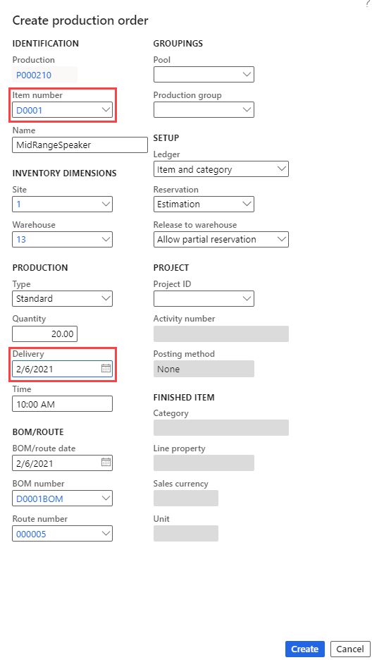

---
lab:
  title: '實驗室 4:建立生產訂單'
  module: 'Module 3: Learn the Fundamentals of Microsoft Dynamics 365 Supply Chain Management'
---

# 模組 3：學習 Microsoft Dynamics 365 Supply Chain Management 的基礎知識

## 實驗室 4:建立生產訂單

## 目標

生產訂單包含關於即將生產的產品、生產數量和計劃完成日期的資訊。 它還包含有關消耗哪些材料以及生產該項目要遵循的程序資訊。

您必須為您的公司建立一個新的生產訂單。

## 實驗設定

   - **預估時間**：5 分鐘

## 指示

1.  在 **[財務與營運] 首頁** 的右上方，確認您是使用 **USMF** 公司。 

1.  如有必要，請選擇公司，然後從功能表中選取 **USMF**。 

1.  在左側流覽窗格中，于 [**生產控制**] 模組中，選取 **[生產訂單**  >  **] [所有生產訂單**]。 

1.  在動作窗格中，選取 **[新增生產訂單**]。 

1.  在 **[識別]** 底下的 [ **專案編號** ] 欄位中，輸入 `D0001` 並選取 **[MidRangeSpeaker]** 專案。 

1.  在 **[生產]** 下方的 [ **傳遞** ] 欄位中，從今天日期選取一個月。 
   
    > **注意：****[傳遞**日期] 會指出生產訂單何時應該結束，以便及時傳遞。 該日期可用於排程程序。 例如，您可以從交付日期向後排程訂單。 

1.  在 [ **數量]** 欄位中，輸入 `20.00` 

    > **注意：** 在 **[BOM/ROUTE**] 下， **[BOM 編號** ] 欄位會自動顯示目前專案的任何使用中 BOM 數目，但您可以從已核准的 BOM 版本清單中選取作用中的 BOM，以變更此生產訂單的 BOM。 [ **路由號碼** ] 欄位會自動顯示目前專案的任何使用中路由數目，但您可以從已核准的路由版本清單中選取作用中路由，以變更此生產訂單的路由。 

    

1.  選取 [建立]。 

1.  **關閉** 頁面並返回首頁。 

